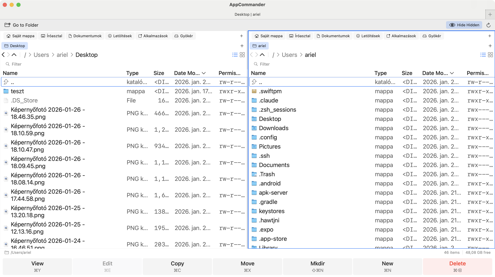

# AppCommander

**Dual-Pane File Manager for macOS**

A powerful, keyboard-driven file manager for macOS. Navigate, copy, move, and manage files with maximum efficiency.

  

## Features

- **Dual-Pane Interface** — Two side-by-side panels for easy file operations
- **Keyboard-First** — Full keyboard navigation with customizable shortcuts
- **Archive Browser** — Browse ZIP, TAR, 7z, RAR as folders
- **SSH/SFTP** — Connect to remote servers seamlessly
- **Tabbed Browsing** — Multiple tabs per panel
- **Customizable** — Themes, columns, fonts, and more

## Download

| Version | Date | Size | Link |
|---------|------|------|------|
| 2026.06.1 | 2026-02-02 | 14 MB | [Download DMG](https://appcommander.pro/releases/AppCommander-2026.06.1.dmg) |

### System Requirements

- macOS 13.0 (Ventura) or later
- Apple Silicon or Intel Mac
- ~50 MB disk space

### Installation

1. Download the DMG file
2. Open the DMG and drag AppCommander to Applications
3. Launch from Applications (right-click → Open on first launch)

## Keyboard Shortcuts

AppCommander supports two shortcut modes: **Modern (macOS)** and **Classic (F-keys)**.

### Modern Mode

| Action | Shortcut |
|--------|----------|
| Copy | `⌘C` |
| Paste | `⌘V` |
| Move | `⌘X` |
| Delete | `⌘⌫` |
| New Folder | `⇧⌘N` |
| Switch Panel | `Tab` |
| New Tab | `⌘T` |
| Close Tab | `⌘W` |
| View/Open | `⌘Y` |
| Edit | `⌘E` |

### Classic Mode (F-keys)

| Action | Shortcut |
|--------|----------|
| Copy | `F5` |
| Move | `F6` |
| New Folder | `F7` |
| Delete | `F8` |
| View/Open | `F3` |
| Edit | `F4` |

## Archive Support

| Format | Browse | Extract | Create |
|--------|--------|---------|--------|
| ZIP | ✓ | ✓ | ✓ |
| TAR / TAR.GZ / TAR.BZ2 | ✓ | ✓ | ✓ |
| 7z | ✓ | ✓ | — |
| RAR | ✓ | ✓ | — |

## SSH/SFTP

Connect to remote servers with:

- Password authentication
- SSH key authentication
- Keyboard-interactive authentication
- SSH tunnel support

Saved connections with optional default paths.

## Screenshots

List View

Icon View

Retro Theme

SSH Connection

## Pricing

| | Free Trial | Licensed |
|--|------------|----------|
| Duration | 60 days | Lifetime |
| Features | Full | Full |
| Updates | ✓ | 1 year |
| Price | Free | €9.99 |

[Purchase License](https://appcommander.pro) · [Activate License](https://appcommander.pro/activate)

## Changelog

### 2026.06.1 (2026-02-02)
- Flat view mode (⌘B) - Show all files recursively
- Batch rename (⇧⌘R) - Rename multiple files with patterns
- Enhanced license validation with offline support
- Automatic update check on app launch

### 2026.05.8 (2026-01-29)
- Slow double-click to rename files inline
- Permanent delete with ⇧⌘⌫
- Swap panels with ⌘U

### 2026.05.4 (2026-01-26)
- Column resize modes: Horizontal Scroll, Fit to Panel, Fit with Wrap

[Full Changelog](docs/CHANGELOG.md)

## Support

- **Email**: support@appcommander.pro
- **Issues**: [GitHub Issues](https://github.com/AppCommander/appcommander.github.io/issues)

## License

AppCommander is commercial software. Free 60-day trial included.

© 2024 AppCommander. All rights reserved.